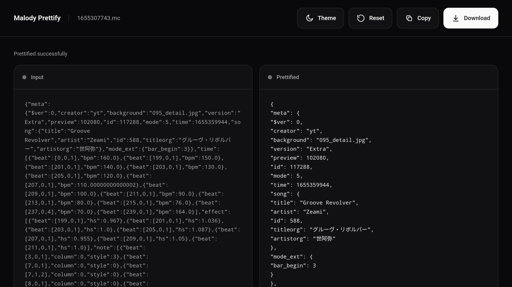
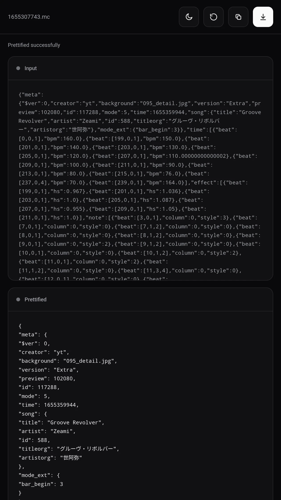

# Malody-Prettify-Web

A web-based tool for formatting Malody chart files (".mc") directly in your browser.

This project is based on "malody-prettify" (https://github.com/LuiCat/malody-prettify) by LuiCat and has been adapted for use as a standalone web application.

## Features

- Import Malody ".mc" chart files
- Format chart data automatically
- Preview the formatted result
- Copy the formatted chart data
- Download the formatted chart as a ".mc" file
- Runs entirely in the browser
- No server-side file upload required

## Usage

1. Import a ".mc" chart file.
2. The chart data is formatted automatically.
3. Review the formatted result.
4. Copy the formatted data or download it as a ".mc" file.

## Examples

## Privacy

Chart files are processed locally in your browser and are not uploaded to a server.

## Credits

This project is based on "malody-prettify" (https://github.com/LuiCat/malody-prettify) by LuiCat.

The original project is licensed under the MIT License.

The original project also credits "JSON Pretty Printer" (https://github.com/sindresorhus/pretty-data) for its JSON formatting functionality.

## License

This project is licensed under the MIT License.

See "LICENSE" (LICENSE) for the full license text.

## Disclaimer

This project is an independent third-party tool and is not affiliated with or endorsed by Malody or its developers.
